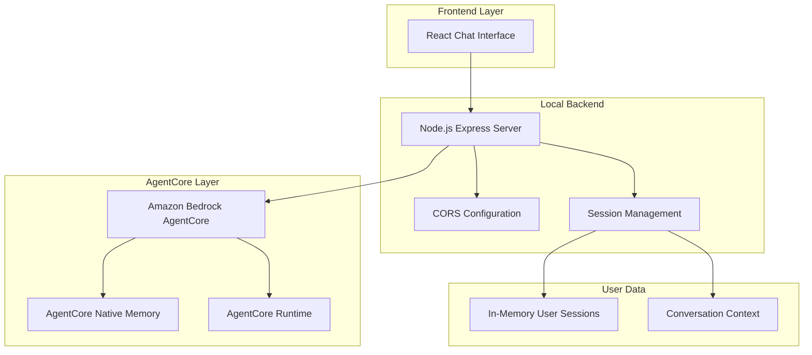

# Design Document

## Overview

The DevOps KnowledgeOps Agent is a simplified, pure chat assistant built on Amazon Bedrock AgentCore that provides expert DevOps guidance through conversational interactions. The architecture focuses exclusively on AgentCore's native capabilities with individual user memory and session management through a clean local backend. No Lambda functions, no complex AWS services - just AgentCore runtime with memory and a local Node.js server.

## Architecture

### Simplified Architecture



### Core Principles

1. **AgentCore-Only**: Direct integration with Bedrock AgentCore without additional AWS services
2. **Local Backend**: Simple Node.js server for CORS and session management
3. **Native Memory**: Use AgentCore's built-in memory capabilities for user context
4. **No Executions**: Pure chat assistant - no infrastructure actions or tool integrations
5. **Individual Sessions**: Each user has separate memory space and conversation history

## Components and Interfaces

### Frontend Components

#### Chat Interface
- **Technology**: React with TypeScript
- **Purpose**: Simple, clean chat interface for DevOps conversations
- **Features**:
  - Real-time messaging
  - Message history display
  - Code syntax highlighting
  - Responsive design
  - Loading states

### Backend Components

#### Local Express Server
```typescript
interface LocalBackendServer {
  // Core chat endpoint
  chat(message: string, sessionId: string, userId?: string): Promise<AgentResponse>
  
  // Session management
  createSession(): Promise<SessionInfo>
  getSessionHistory(sessionId: string): Promise<MessageHistory>
  
  // Health check
  health(): Promise<HealthStatus>
}
```

#### AgentCore Integration
```typescript
interface AgentCoreConfig {
  agentId: string              // MNJESZYALW
  agentAliasId: string         // TSTALIASID
  region: string               // us-east-1
  enableMemory: boolean        // true
  sessionTimeout: number       // 24 hours
}
```

### AgentCore Configuration

#### Core Agent Setup
```json
{
  "agentName": "DevOpsKnowledgeOpsAgent",
  "description": "Expert DevOps chat assistant with memory",
  "foundationModel": "anthropic.claude-3-5-sonnet-20241022-v2:0",
  "instruction": "You are an expert DevOps engineer with deep knowledge across all aspects of DevOps practices, tools, and methodologies. Provide clear, actionable guidance while remembering user context and preferences across conversations.",
  "enableMemory": true,
  "memoryConfiguration": {
    "enableSessionPersistence": true,
    "memoryRetentionDays": 30,
    "enableContextualRecall": true
  }
}
```

#### Memory Management
- **Session-Based**: Each user gets individual memory space
- **Context Retention**: Conversation history maintained across sessions
- **Preference Learning**: AgentCore learns user communication style and preferences
- **Automatic Cleanup**: Old conversations automatically managed by AgentCore

## Data Models

### Session Management
```typescript
interface UserSession {
  sessionId: string
  userId?: string
  createdAt: Date
  lastActivity: Date
  agentSessionId: string  // AgentCore session ID
  metadata: {
    userPreferences?: UserPreferences
    conversationCount: number
    lastTopic?: string
  }
}

interface ChatMessage {
  id: string
  sessionId: string
  role: 'user' | 'assistant'
  content: string
  timestamp: Date
}
```

### AgentCore Integration
```typescript
interface AgentCoreRequest {
  message: string
  sessionId: string
  userId?: string
  enableTrace?: boolean
}

interface AgentCoreResponse {
  response: string
  sessionId: string
  responseTime: number
  metadata: {
    agentId: string
    memoryUsed: boolean
    contextRecalled: boolean
  }
}
```

## API Design

### Local Backend Endpoints

| Endpoint | Method | Description |
|----------|--------|-------------|
| `/api/health` | GET | Health check and system status |
| `/api/session` | POST | Create or manage user sessions |
| `/api/chat` | POST | Send message to AgentCore |

### Request/Response Examples

**Chat Request:**
```json
{
  "message": "How do I optimize my Docker containers for production?",
  "sessionId": "session-123",
  "userId": "user-456"
}
```

**Chat Response:**
```json
{
  "success": true,
  "response": "Here are the key strategies for optimizing Docker containers for production...",
  "sessionId": "session-123",
  "metadata": {
    "responseTime": 2.3,
    "agentId": "MNJESZYALW",
    "memoryUsed": true,
    "contextRecalled": false
  }
}
```

## Memory System Design

### AgentCore Native Memory
- **Built-in Capabilities**: Leverage AgentCore's native memory management
- **Session Persistence**: Automatic conversation context retention
- **User Isolation**: Each user session is completely separate
- **Context Awareness**: Previous conversations inform current responses

### Memory Structure
```typescript
interface MemoryContext {
  userProfile: {
    skillLevel?: 'beginner' | 'intermediate' | 'advanced'
    preferredTools?: string[]
    infrastructureContext?: string
    communicationStyle?: string
  }
  conversationHistory: {
    recentTopics: string[]
    commonQuestions: string[]
    preferredResponseFormat: string
  }
  technicalContext: {
    currentProjects?: string[]
    technologyStack?: string[]
    environmentType?: 'development' | 'staging' | 'production'
  }
}
```

## Error Handling

### Error Categories
1. **AgentCore Errors**: Timeout, service unavailable, quota exceeded
2. **Session Errors**: Invalid session, expired session, session not found
3. **Input Errors**: Invalid message format, empty message, message too long
4. **System Errors**: Server errors, network issues, configuration problems

### Error Response Format
```typescript
interface ErrorResponse {
  success: false
  error: {
    code: string
    message: string
    details?: string
    suggestions?: string[]
  }
  timestamp: Date
  sessionId?: string
}
```

## Testing Strategy

### Unit Testing
- **Backend Logic**: Jest for server endpoints and AgentCore integration
- **Frontend Components**: React Testing Library for UI components
- **Memory Management**: Test session isolation and context retention

### Integration Testing
- **AgentCore Communication**: Test direct AgentCore integration
- **Session Management**: Verify user session isolation
- **Memory Persistence**: Test conversation context retention

### Performance Testing
- **Response Time**: Target <5 seconds for AgentCore responses
- **Concurrent Sessions**: Test multiple user sessions simultaneously
- **Memory Usage**: Monitor session memory consumption

## Security Considerations

### Authentication
- **Simple Session-Based**: Basic session management for user identification
- **No Complex Auth**: Avoid over-engineering for chat assistant use case
- **Session Isolation**: Ensure complete separation between user sessions

### Data Protection
- **In-Memory Sessions**: No persistent storage of sensitive data
- **AgentCore Security**: Leverage Bedrock's built-in security features
- **Input Sanitization**: Basic input validation and sanitization

### Privacy
- **User Isolation**: Complete separation of user conversations
- **Memory Boundaries**: AgentCore ensures memory isolation between users
- **No Data Persistence**: Conversations managed by AgentCore, not stored locally

## Deployment Architecture

### Local Development
- **Single Server**: Node.js Express server with AgentCore integration
- **Environment Variables**: Simple configuration for AgentCore connection
- **Hot Reload**: Development-friendly setup with automatic restarts

### Production Deployment Options
1. **Single EC2 Instance**: Simple deployment for small teams
2. **Container Deployment**: Docker container with environment configuration
3. **Serverless Option**: Could be adapted to Lambda if needed later

### Configuration Management
```typescript
interface DeploymentConfig {
  // AgentCore Configuration
  BEDROCK_AGENT_ID: string
  BEDROCK_AGENT_ALIAS_ID: string
  AWS_REGION: string
  
  // Server Configuration
  PORT: number
  CORS_ORIGIN: string
  
  // Session Configuration
  SESSION_TIMEOUT: number
  MAX_CONCURRENT_SESSIONS: number
}
```

## Benefits of Simplified Architecture

### Development Benefits
- **Faster Development**: No complex AWS service integration
- **Easy Debugging**: Simple request/response flow
- **Local Testing**: Full functionality available locally
- **Minimal Dependencies**: Fewer moving parts to manage

### Operational Benefits
- **Reliable Performance**: Direct AgentCore integration
- **Predictable Costs**: No serverless cold starts or complex pricing
- **Easy Monitoring**: Simple server metrics and AgentCore logs
- **Straightforward Deployment**: Single server deployment

### User Experience Benefits
- **Fast Responses**: Direct AgentCore communication
- **Consistent Memory**: AgentCore's native memory management
- **Personalized Experience**: Individual user sessions with context
- **No Complexity**: Pure chat experience without feature bloat

## AgentCore Capabilities

### DevOps Knowledge Areas
- **Infrastructure as Code**: Terraform, CloudFormation, Pulumi guidance
- **Container Technologies**: Docker, Kubernetes, container orchestration
- **CI/CD Pipelines**: Jenkins, GitLab CI, GitHub Actions, AWS CodePipeline
- **Monitoring & Observability**: Prometheus, Grafana, ELK Stack, CloudWatch
- **Security & Compliance**: DevSecOps practices, security scanning
- **Cloud Platforms**: AWS, Azure, GCP best practices and troubleshooting

### Conversation Capabilities
- **Context Awareness**: Remembers previous conversations and user preferences
- **Skill Adaptation**: Adjusts responses based on user's demonstrated knowledge level
- **Problem Solving**: Systematic approach to troubleshooting and debugging
- **Best Practices**: Industry-standard recommendations with rationale
- **Learning Support**: Educational guidance and resource recommendations

This simplified architecture provides all the core benefits of AgentCore (expert knowledge, memory, personalization) while eliminating complexity and focusing on the primary use case: intelligent DevOps knowledge sharing through chat.