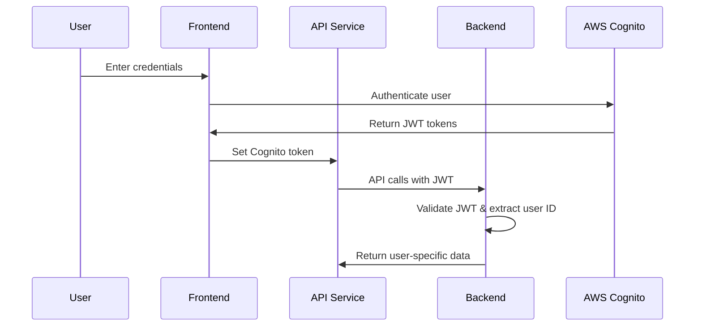

# AWS Cognito Authentication Setup

## Overview

This application now uses AWS Cognito for proper user management and authentication, replacing the previous demo authentication system.

## Features

### 🔐 **Security**
- **JWT Tokens**: Secure, signed tokens with proper expiration
- **Password Policies**: Configurable password requirements
- **Session Management**: Automatic token refresh and validation
- **User Isolation**: Each user has a unique Cognito ID ensuring complete session isolation

### 👥 **User Management**
- **Registration**: Email-based user registration with verification
- **Login/Logout**: Secure authentication flow
- **Password Reset**: Built-in password recovery
- **User Profiles**: Extensible user attributes

### 🏢 **Enterprise Ready**
- **Multi-Factor Authentication**: Optional MFA support
- **OAuth/SAML**: Enterprise SSO integration
- **User Groups**: Role-based access control
- **Audit Logging**: Complete authentication audit trail

## Setup Instructions

### 1. **AWS Cognito Configuration**

#### Create User Pool
```bash
# Run the setup script
./scripts/setup-cognito.ps1

# Or manually create via AWS Console:
# 1. Go to AWS Cognito Console
# 2. Create User Pool
# 3. Configure sign-in options (email)
# 4. Set password policy
# 5. Create App Client
```

#### Environment Variables
```bash
# Add to .env file
USER_POOL_ID=us-east-1_YourPoolId
USER_POOL_CLIENT_ID=YourClientId
USER_POOL_CLIENT_SECRET=YourClientSecret
AWS_REGION=us-east-1
```

### 2. **Application Migration**

#### Run Migration Script
```bash
# Migrate from demo authentication
./migrate-to-cognito.ps1
```

#### Manual Steps
1. **Clear Browser Storage**:
   ```javascript
   // In browser console
   localStorage.removeItem('accessToken');
   localStorage.removeItem('devops-user');
   ```

2. **Restart Application**:
   ```bash
   # Backend
   cd backend && npm start
   
   # Frontend  
   cd frontend && npm start
   ```

### 3. **Testing**

#### Test Cognito Integration
```bash
# Run integration test
node test-cognito-integration.js
```

#### Test User Isolation
```bash
# Test with multiple users
node test-cognito-user-isolation.js
```

## Architecture

### Authentication Flow



### Token Handling

#### Frontend (API Service)
```typescript
class ApiService {
  setCognitoToken(accessToken: string): void {
    this.accessToken = accessToken;
    localStorage.setItem('accessToken', accessToken);
  }

  private makeRequest<T>(endpoint: string): Promise<T> {
    const headers = {
      'Authorization': `Bearer ${this.accessToken}`
    };
    // ... make request
  }
}
```

#### Backend (Token Validation)
```javascript
function getUserFromToken(authHeader) {
  const token = authHeader.substring(7); // Remove 'Bearer '
  
  // Decode JWT payload
  const payload = JSON.parse(
    Buffer.from(token.split('.')[1], 'base64').toString()
  );
  
  // Return Cognito user ID
  return payload.sub;
}
```

### Session Isolation

Each user gets a unique identifier from Cognito (`sub` claim in JWT), ensuring:
- ✅ **Complete session separation**
- ✅ **No cross-user data access**
- ✅ **Secure multi-tenancy**

## User Interface

### Login Form
- Email/password authentication
- "Sign Up" link for new users
- Error handling and validation
- "Forgot Password" support

### Registration Form
- Email verification required
- Password policy enforcement
- Automatic login after registration
- User-friendly error messages

### User Menu
- Display user email
- Authentication status
- Logout functionality
- Profile management (future)

## API Endpoints

### Authentication Endpoints

#### Sign In
```http
POST /auth
Content-Type: application/json

{
  "action": "signin",
  "username": "user@example.com",
  "password": "SecurePassword123!"
}
```

#### Sign Up
```http
POST /auth
Content-Type: application/json

{
  "action": "signup",
  "username": "user@example.com",
  "email": "user@example.com",
  "password": "SecurePassword123!"
}
```

#### Token Verification
```http
POST /auth
Content-Type: application/json

{
  "action": "verify",
  "accessToken": "eyJhbGciOiJSUzI1NiIs..."
}
```

### Protected Endpoints

All chat and session endpoints now require:
```http
Authorization: Bearer <cognito-jwt-token>
```

## Security Considerations

### Token Security
- **JWT Validation**: Tokens are decoded and validated
- **Expiration**: Automatic token expiration (1 hour default)
- **Refresh**: Token refresh capability built-in
- **Storage**: Secure localStorage with cleanup on logout

### User Isolation
- **Unique IDs**: Each user has a unique Cognito sub ID
- **Session Ownership**: Users can only access their own sessions
- **Message Privacy**: Cross-user message access is blocked
- **Data Separation**: Complete data isolation per user

### Production Recommendations
1. **JWT Signature Verification**: Implement full JWT signature validation
2. **HTTPS Only**: Ensure all communication is encrypted
3. **Token Refresh**: Implement automatic token refresh
4. **Rate Limiting**: Add API rate limiting per user
5. **Audit Logging**: Log all authentication events

## Troubleshooting

### Common Issues

#### "User Pool not configured"
```bash
# Check environment variables
echo $USER_POOL_ID
echo $USER_POOL_CLIENT_ID

# Run setup script
./scripts/setup-cognito.ps1
```

#### "Authentication failed"
- Verify user exists in Cognito User Pool
- Check password meets policy requirements
- Ensure User Pool allows USER_PASSWORD_AUTH flow

#### "Token validation failed"
- Check token format (should be JWT with 3 parts)
- Verify token hasn't expired
- Ensure correct User Pool configuration

### Debug Commands

```bash
# Test Cognito connection
node test-cognito-integration.js

# Check backend logs
tail -f backend/logs/app.log

# Verify frontend token
# In browser console:
console.log(localStorage.getItem('accessToken'));
```

## Migration from Demo Authentication

### What Changed
- ❌ **Removed**: Demo token generation (`signInDemo()`)
- ✅ **Added**: Cognito JWT token handling
- ✅ **Enhanced**: User identification via Cognito sub ID
- ✅ **Improved**: Secure session isolation

### Backward Compatibility
The system maintains backward compatibility with demo tokens during transition, but new sessions require Cognito authentication.

### Data Migration
- Existing demo sessions will be cleared
- Users need to create Cognito accounts
- Chat history starts fresh with proper user isolation

## Next Steps

### Immediate
1. ✅ **Test login/registration flow**
2. ✅ **Verify session isolation**
3. ✅ **Test chat functionality**

### Future Enhancements
- 🔄 **Token refresh automation**
- 🔐 **Multi-factor authentication**
- 👥 **User groups and roles**
- 📊 **Usage analytics per user**
- 🔗 **OAuth/SAML integration**

## Support

For issues or questions:
1. Check the troubleshooting section above
2. Review AWS Cognito documentation
3. Test with the provided integration scripts
4. Check backend logs for detailed error messages